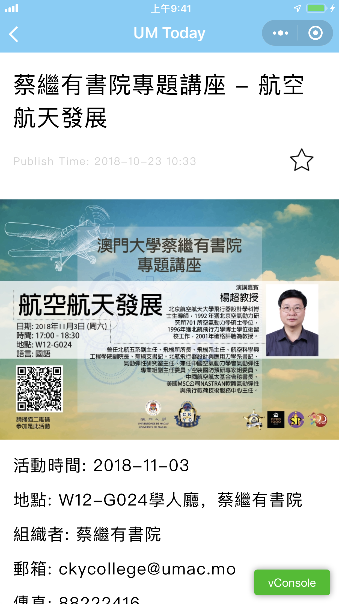
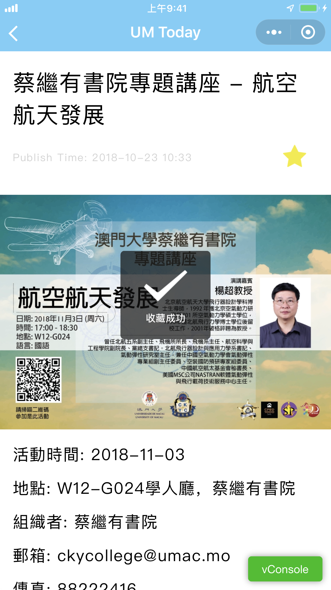
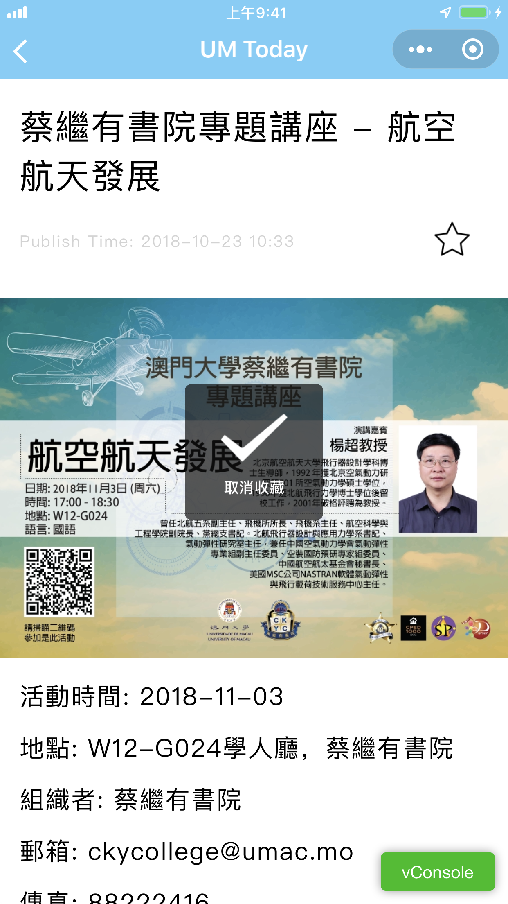

# UM Today

## Overview

Our Mini Program, *UM Today*, is designed to offer an overview of news and events to facilitate the process of finding and choosing activities for students in University of Macau.

## Platform

Wechat Mini Program

## API

Events and News

## Main Functions

### News Page

{:height="50%" width="50%"}

### Activity Page

{:height="50%" width="50%"}

### Detail Page

{:height="50%" width="50%"}

### Add to Collection

{:height="50%" width="50%"}
{:height="50%" width="50%"}

## Compile and Test

請于微信小程序開發工具內打開文件夾，創建測試號進行測試，修改。
如要真機調試，請刪除 ImgForREADME 文件夾防止超出大小限制。